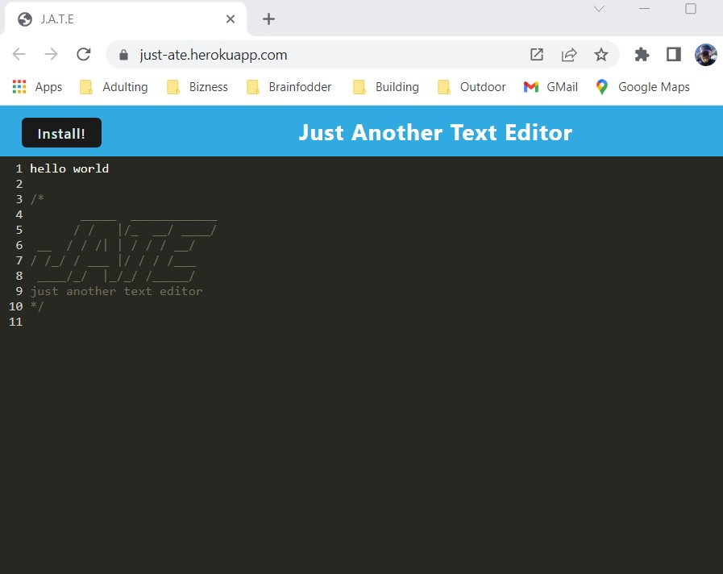

# JATE Just Another Text Editor

## Description

JATE is a web-based text editor that runs in the browser. The application features data persistence techniques that serve as redundancy in case one of the options is not supported by the browser. The application is also available to use offline if the user chooses to install on their local device.

## Table of Contents

- [Installation](#installation)
- [Heroku](#heroku)
- [Github Repository](#github-repo)
- [Screenshot](#screenshot)
- [Usage](#usage)
- [Tests](#tests)
- [License](#license)
- [Questions](#questions)

#

## Installation

This application requires Node.js as well as various npm package dependencies. To install locally, the user may visit the GitHub repository listed below and clone to their local device. All dependencies are included in NPM package; once installed the user may navigate to their local directory's command line and enter "npm i && npm start". The user may now use the application in their browser's localhost.

If the user would like to install application without a git-repository, they may navigate to deployed application below and click "install" button located at top-left of page.

#

## Heroku App

#

Heroku Link: [Just-ATE](https://just-ate.herokuapp.com/)

#

## GitHub Repository

[GitHub Repo: Yogibruce/JATE](https://github.com/YogiBruce/JATE)

#
## Screenshots

 

## Usage

#

This application is built into a client/server structure.

#

When user runs installation, they will see the backend server start and the webpack plugins bundle Javascript files.

#

The user will notice this has generated their HTML file, service worker, and manifest file.

#

Next-gen JS allows the text-editor application to function in the browser offline without error. 

#

The application uses IndexedDB to store and persist data, even if application has been closed.

#

The application is able to be downloaded locally and uses a registered service worker that provides static assets that are pre-cached upon loading.

#

The application is deployed to Heroku with proper build scripts for a webpack application.

#

## Tests

There are no tests for this application.

#

### MIT License [vist link](https://choosealicense.com/licenses/mit/)

Copyright 2023 - Robert B Arnold Jr

Permission is hereby granted, free of charge, to any person obtaining a copy of this software and associated documentation files (the "Software"), to deal in the Software without restriction, including without limitation the rights to use, copy, modify, merge, publish, distribute, sublicense, and/or sell copies of the Software, and to permit persons to whom the Software is furnished to do so, subject to the following conditions:

The above copyright notice and this permission notice shall be included in all copies or substantial portions of the Software.

THE SOFTWARE IS PROVIDED "AS IS", WITHOUT WARRANTY OF ANY KIND, EXPRESS OR IMPLIED, INCLUDING BUT NOT LIMITED TO THE WARRANTIES OF MERCHANTABILITY, FITNESS FOR A PARTICULAR PURPOSE AND NONINFRINGEMENT. IN NO EVENT SHALL THE AUTHORS OR COPYRIGHT HOLDERS BE LIABLE FOR ANY CLAIM, DAMAGES OR OTHER LIABILITY, WHETHER IN AN ACTION OF CONTRACT, TORT OR OTHERWISE, ARISING FROM, OUT OF OR IN CONNECTION WITH THE SOFTWARE OR THE USE OR OTHER DEALINGS IN THE SOFTWARE.

#

## Questions

For any questions regarding this application or any other project by YogiBruce:

### Email: [Gmail](mailto:da.bruce.jr@gmail.com)

### Gihub Profile: [YogiBruce](https://github.com/YogiBruce)
